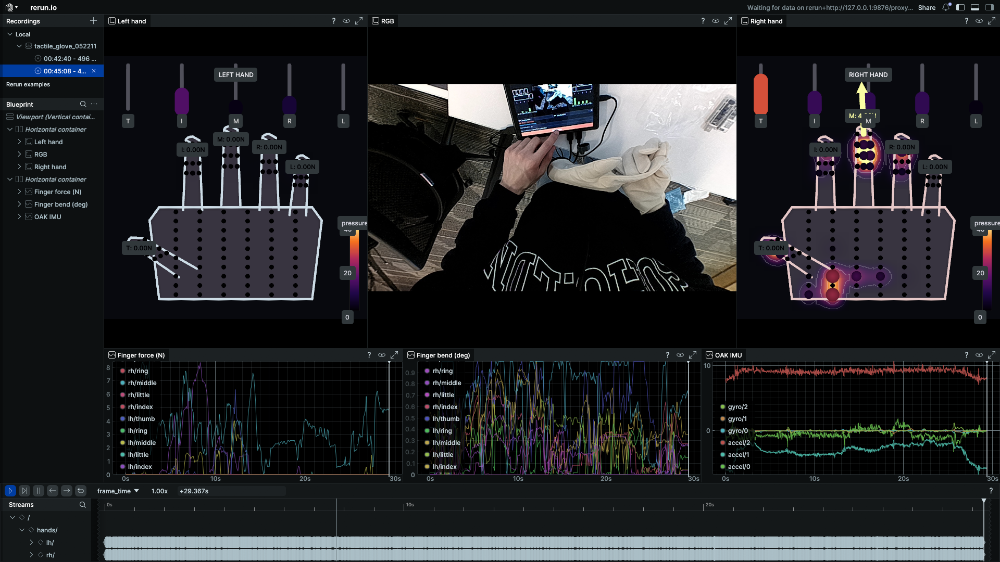

# tactile-reader

> Rerun-based visualizer and timeline cropper for tactile-glove + OAK camera captures.
> Drop it on a capture directory, scrub the timeline, find the meaningful segment,
> click crop — out comes a clean self-contained sub-dataset.



Built for the DeepReach data-collection setup: each capture is a directory of
`frames.parquet` (per-frame tactile + IMU rows), `oak_imu.parquet` (high-rate IMU),
an `rgb/` (and optional `mono_left/`, `mono_right/`) image folder, and a
`calib.json` with finger-bend and tactile-zero calibration.

## What you get

Three CLI tools that share the same dataset assumption:

| Command                            | Purpose |
|------------------------------------|---------|
| `tactile-reader-viz <dir>`         | Open Rerun viewer, scrub the timeline |
| `tactile-reader-crop-gui <dir>`    | Tkinter window to pick a frame range and crop |
| `tactile-reader-crop <dir> --start S --end E` | Headless crop (use in scripts / batch) |

Every tool defaults `<dir>` to the current working directory, so `cd` into a
capture and just run the command.

Append `--help` to any of them for the full flag list.

### Viewer (`tactile-reader-viz`)

A multi-panel Rerun blueprint that opens with a sensible default layout:

- **Top row**: Left hand · RGB camera · Right hand
- **Hand panels** for each side:
  - skin-tone silhouette + 120-taxel point cloud (size + color = pressure)
  - inferno tactile heatfield with bloom halo
  - white iso-pressure contour lines
  - 5 fingertip force-vector arrows with per-finger Newton readouts (always on top)
  - 5 bend-angle bars + T/I/M/R/L initials at the top
  - inset 0..40 pressure colorbar
- **Bottom row**: per-finger force (N) · per-finger bend angle · OAK IMU accel+gyro
- **Single scrubbable 0..duration timeline** drives every panel (hand IMU and OAK
  IMU clocks are remapped onto the frames clock so they stay aligned).

### Crop GUI (`tactile-reader-crop-gui`)

A single Tk window. Two range sliders, two live RGB thumbnails (start / end), a
total-force strip plot showing where contact happens across the whole capture
(highlighted band = current selection). `Dry run` to preview, `Crop!` to write.

### Crop CLI (`tactile-reader-crop`)

Pick the range any of three ways — match whichever number the viewer hands you:

| Bound | By frame_idx       | By percent          | By seconds-from-start |
|-------|--------------------|---------------------|-----------------------|
| start | `--start 24`       | `--start-pct 0.10`  | `--start-ts 3.5`      |
| end   | `--end 287`        | `--end-pct 0.90`    | `--end-ts 27.0`       |

Both bounds are inclusive. `--dry-run` prints what would happen without writing.

## Install

```bash
git clone git@github.com:zekai-chen-deepreach/tactile-reader.git
cd tactile-reader
pip install -e .
```

Requirements: Python 3.10+, plus `numpy / pandas / pyarrow / pillow / rerun-sdk`
(picked up automatically by pip).

On Linux the GUI needs system Tk:

```bash
sudo apt install python3-tk
```

If you use conda, install into an env *before* `pip install -e .`:

```bash
conda create -n tactile python=3.11 -y
conda activate tactile
pip install -e .
```

## Workflow

```bash
# 1. inspect a fresh capture
tactile-reader-viz /path/to/052211
# scrub the timeline, note the frame_idx of the segment you want to keep

# 2a. quick interactive crop
tactile-reader-crop-gui /path/to/052211
# drag the two sliders, press Crop!

# 2b. or scripted crop (great for batch processing)
tactile-reader-crop /path/to/052211 --start 24 --end 287

# 3. re-open the cropped output to verify
tactile-reader-viz /path/to/052211_cropped
```

## Expected dataset layout

```
<capture_dir>/
  frames.parquet      one row per frame: per-hand pressure (12 finger + 60 palm taxels),
                      per-finger force (N, cal), bend angles, hand IMU, paths to images.
  oak_imu.parquet     high-rate accel + gyro (host-monotonic timestamps)
  rgb/000000.jpg ...  RGB stream            (required by viewer)
  mono_left/          left grayscale        (optional — copied by crop if present)
  mono_right/         right grayscale       (optional — copied by crop if present)
  calib.json          { gloves: {lh,rh}: {bend_min,max, tactile_zero_finger, tactile_zero_palm},
                        glove_force: {lh,rh}: {finger: c3,c2,c1,c0 poly} }
```

See [`examples/sample_capture_schema.md`](examples/sample_capture_schema.md) for the
full `frames.parquet` column list and `calib.json` shape.

## Crop output

`tactile-reader-crop <dir> --start S --end E` writes a new self-contained
dataset directory:

```
<dir>_cropped/
  frames.parquet     subset rows, frame_idx renumbered from 0
  oak_imu.parquet    IMU samples mapped into the kept window
  rgb/000000.jpg ... renamed contiguously to match the new frame_idx
  mono_left/         (if present in source)
  mono_right/        (if present in source)
  calib.json         copied from source
  crop_meta.json     {source, start_frame, end_frame, start_ts, end_ts, n_frames, duration_sec}
```

The source directory is **never modified**. If `<dir>_cropped` already exists a
numbered suffix is appended (`_2`, `_3`, …) — nothing is overwritten.

## Troubleshooting

**The Rerun viewer opens but the timeline looks like it plays back in ~1 second**
- Check the speed multiplier in the time panel (next to the play button). The
  default unit on a `duration` timeline can vary by version; set it to `1.00x`.

**`No module named tactile_reader` after install**
- You probably installed into a different Python than the one on your PATH.
  Run `which python && which pip` and re-install in that env: `pip install -e .`.

**`_tkinter` not found (GUI fails to launch)**
- Install Tk: `sudo apt install python3-tk` on Debian/Ubuntu.

**Viewer's hand panels show old/stale entities (e.g. empty Mono panels)**
- Rerun caches per-recording blueprints under `~/.config/rerun/`. This project
  force-overwrites the blueprint on every launch, but if you have older versions
  cached you can `rm -rf ~/.config/rerun/blueprints/` and relaunch.

**Crop reports `empty crop` or "no frames in [s, e]"**
- The bounds must lie inside `[frame_idx.min(), frame_idx.max()]` of the source
  (printed at the top of `tactile-reader-crop` output). Use `--dry-run` to verify.

## License

MIT — see [LICENSE](LICENSE).
